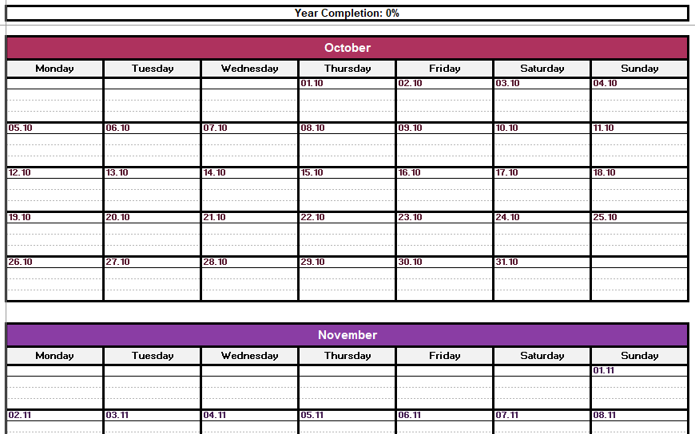

# 📅 2026 Dynamic Excel Calendar Generator

This VBA macro generates a clean, printable, and smart 2026 calendar directly in Excel. It’s not just a static picture - it actually knows what day it is.

### What it looks like 

### What it does

* **Generates a full 2026 Year View:** Creates a new sheet with months, days, and plenty of space for notes.
* **Live Year Progress Bar:** A bar at the top (Rows 2-3) automatically fills up as the year goes by. It updates daily based on the system clock.
* *Style:* Dark Gray bar, displaying "Year Completion: XX%".

* **Smart "Today" Highlighter:** The calendar checks your computer's date every time you open the sheet. The current day will automatically light up **Deep Red** with **White Bold Text** so you never lose your place.
* **Print-Ready Layout:** Formatted with custom colors, borders, and dotted lines for handwritten notes.

### How to use it

1. Open **Excel** on your computer.
2. Press **`ALT + F11`** to open the VBA Editor.
3. In the menu, go to **Insert > Module**.
4. Paste the code into the empty window.
5. Click inside the code and press **F5** (or click the green "Play" button) to run it.

### Quick Notes

* **Fonts:** The script is set to use the font **"Atopos"**. If you don't have this installed, Excel will default to Arial or Calibri. You can either install Atopos or do a "Find & Replace" in the code to swap it for your favorite font (like "Helvetica" or "Segoe UI").
* **Changing the Year:** Look for the line `yearVal = 2026` near the top of the code. Change `2026` to `2025` (or any other year) to generate a calendar for that specific year.
* **Updating:** The "Current Day" highlight and "Year Progress" bar update automatically whenever Excel recalculates (e.g., when you open the file or edit a cell). You don't need to re-run the macro daily.

---

**Enjoy your new calendar!**
